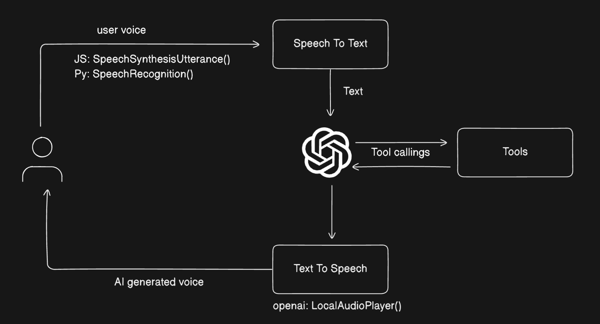

# Voice-Enabled IDE with LangGraph

A voice-controlled IDE interface built using LangGraph and GPT-4, enabling natural language commands to control your development environment.



## Overview

This project demonstrates how to build a voice-enabled IDE using LangGraph's state management and checkpointing capabilities. It allows developers to:

- Issue voice commands for common IDE operations
- Maintain conversation context across sessions
- Process and execute IDE actions through LLM

## System Architecture

The system is built on three main components:

1. **Voice Command Processing** (`main.py`)

   - Captures voice input and converts to text
   - Manages conversation state using MongoDB
   - Streams responses in real-time
   - Maintains thread-based conversation tracking

2. **LangGraph Implementation** (`graph.py`)

   - Defines IDE-specific tools for code manipulation
   - Implements conditional routing for commands
   - Integrates with GPT-4 for command understanding
   - Manages state persistence through MongoDB

3. **State Management** (`docker-compose.db.yml`)
   - MongoDB-based state persistence
   - Checkpointing for conversation recovery
   - Thread-based state isolation

## How It Works

1. **Command Processing Flow**

   ```
   Voice Input -> Text Conversion -> LLM Processing -> Tool Execution -> IDE Action
   ```

2. **State Management Flow**

   ```
   Command -> MongoDB Checkpoint -> Tool Execution -> State Update -> Response
   ```

3. **Tool Execution Flow**
   ```
   LLM Analysis -> Tool Selection -> Action Execution -> State Update
   ```

## Implementation Details

### State Structure

```python
class State(TypedDict):
    messages: Annotated[list, add_messages]  # Conversation history
    command_history: List[str]               # Command tracking
```

### MongoDB Integration

- Uses `MongoDBSaver` for state persistence
- Maintains conversation checkpoints
- Enables session recovery and continuation
- Thread-based state isolation

### Available IDE Commands

1. **File Operations**

   - Open files
   - Create new files
   - Save current file
   - Switch between files

2. **Code Manipulation**

   - Create functions/classes
   - Find references
   - Jump to definition
   - Run current file

3. **Navigation**
   - Go to line
   - Find symbol
   - Navigate between files
   - Search in workspace

## Setup Instructions

1. **Start MongoDB**

   ```bash
   docker-compose -f docker-compose.db.yml up -d
   ```

2. **Install Dependencies**

   ```bash
   pip install -r requirements.txt
   ```

3. **Run the Application**
   ```bash
   python main.py
   ```

## Usage Examples

1. **Basic File Operations**

   ```
   "Open main.py"
   "Create new file utils.py"
   "Save current file"
   ```

2. **Code Navigation**

   ```
   "Find all references to user_input"
   "Go to line 42"
   "Show definition of process_command"
   ```

3. **Code Generation**
   ```
   "Create function process_data with parameters input and output"
   "Add try-catch block here"
   "Generate unit test for current function"
   ```

## Technical Components

1. **Voice Processing**

   - Real-time voice capture
   - Text conversion
   - Noise reduction

2. **LangGraph Integration**

   - Tool definition and binding
   - State management
   - Conditional routing

3. **MongoDB Persistence**
   - State checkpointing
   - Session management
   - Thread isolation

